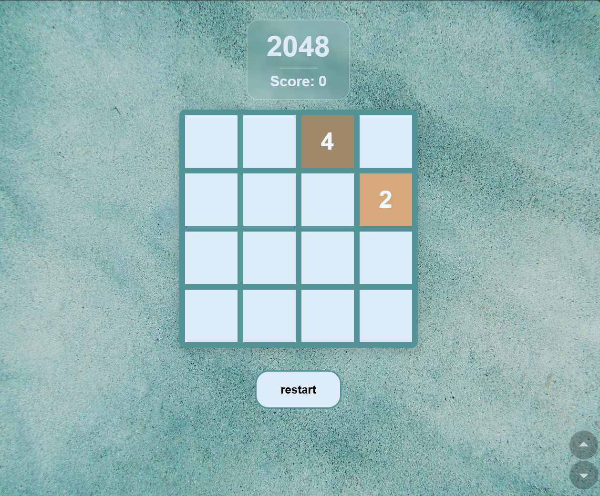

# 🎮 2048 Game

A simple yet beautiful implementation of the classic **2048 puzzle game**, built entirely with **HTML, CSS, and JavaScript**.  
This project recreates the addictive gameplay of 2048, featuring smooth animations, responsive design, and a clean, modern interface.

---

## 🧠 About the Game

In **2048**, you slide numbered tiles on a 4×4 grid to combine them and create a tile with the number **2048**.  
Every move spawns a new tile (2 or 4). Keep combining and planning your moves strategically — once the board is full, the game is over!

---

## ✨ Features

- 🎨 **Clean, modern UI** with soft pastel tones and transparent overlays  
- 🧩 **Fully functional gameplay** logic built in pure JavaScript (no frameworks)  
- 📱 **Responsive layout** — works on desktop and mobile  
- 💾 **Score tracking** with live updates  
- 🔁 **Restart button** and **game over screen overlay**  
- ⚡ Smooth tile updates and dynamic color themes for different tile values  

---

## 🛠️ Technologies Used

- **HTML5** — Structure and layout  
- **CSS3** — Styling, animations, and responsive design  
- **JavaScript (ES6)** — All game logic and interactivity  

---

## 📂 Project Structure

